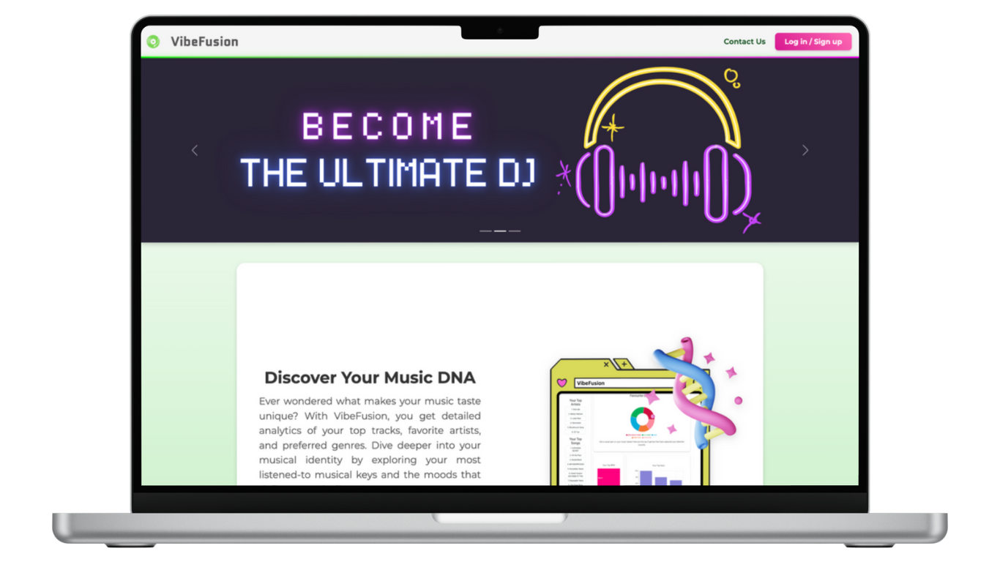
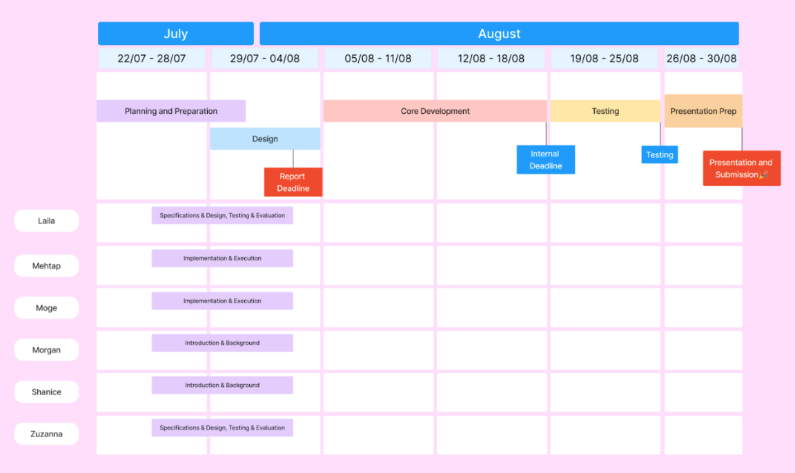
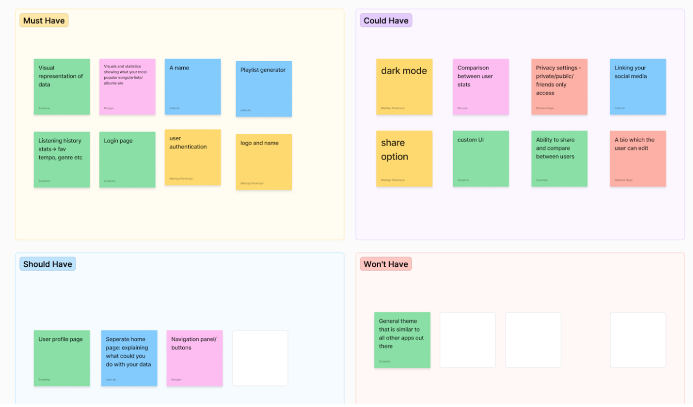
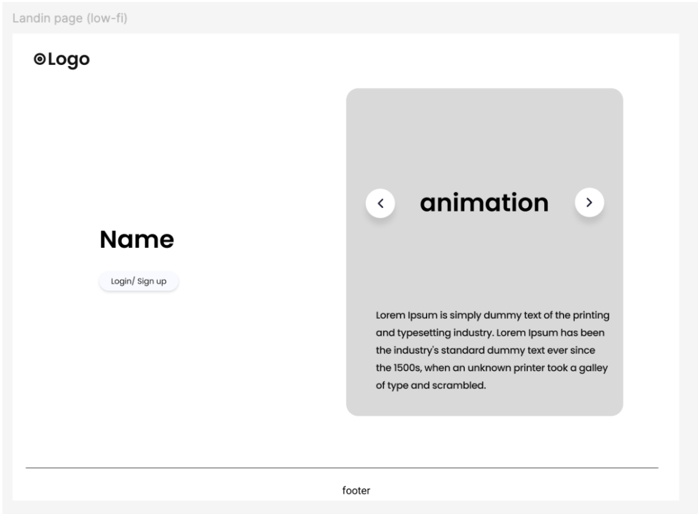
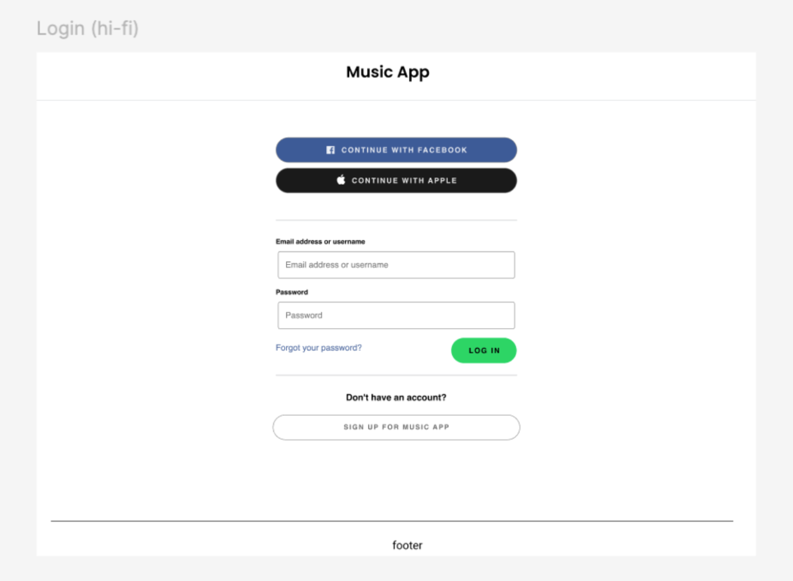
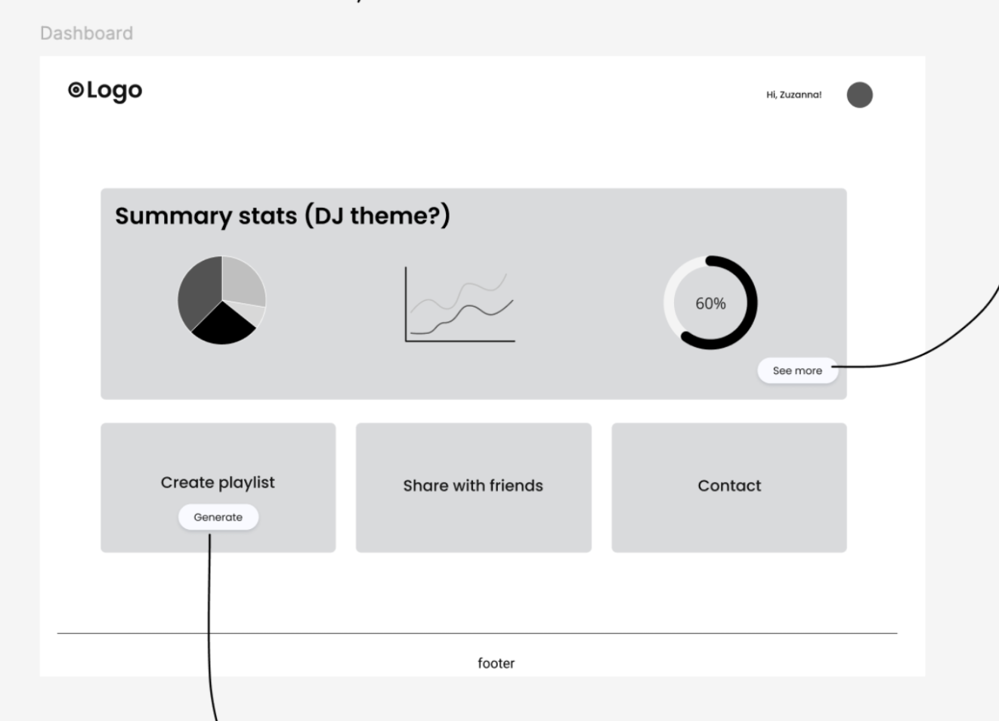
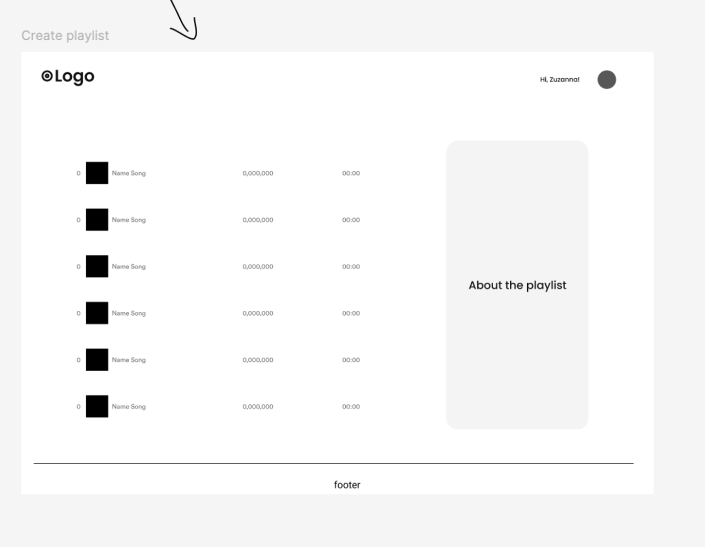
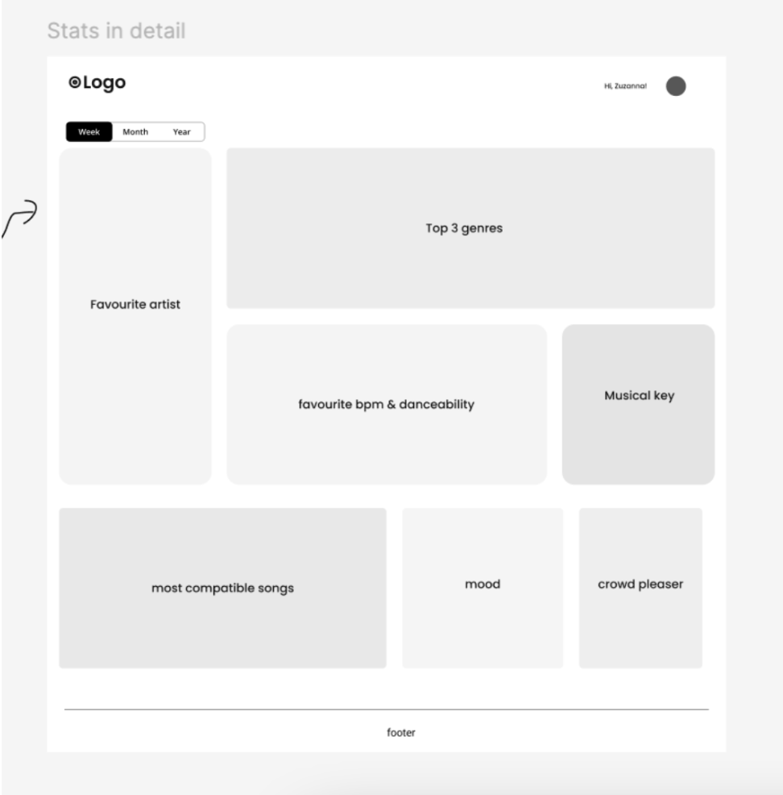
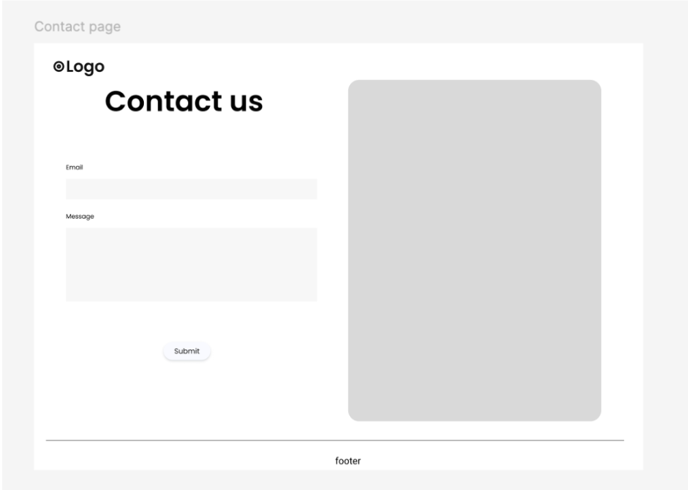
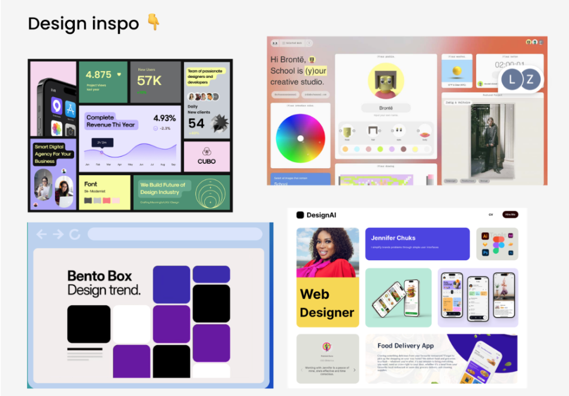

# Introduction

<code style="color : hotpink">***VibeFusion***</code> is a personalised web application designed to track and create a fun vibrant and engaging visual representation of a users’ Spotify listening habits over time. Inspired by SpotifyWrapped which is an annual feature that provides users with a personalized summary of their musical data over the past year. The aim of VibeFusion is to provide a continuous and detailed insight into the users’ musical preferences, extending beyond the summary offered by Spotify Wrapped, data that is available to the user year round.

By utilising the Spotify API, <code style="color : Greenyellow">***VibeFusion***</code> delivers personalised statistics on top artists, albums, songs and genres, audio features and musical analysis. Unlike standard music tracking apps, VibeFusion's DJ feature offers detailed insights into musical elements like tempo (BPM), musical key, users' mood and danceability. This level of detail is particularly valuable for users interested in the nuances of music mixing and curation. This feature uses data from the 'Summary Stats'/’DJ Page’ section to influence the playlist users are able to generate and that will appear in directly on the linked spotify account seamlessly. By integrating  Spotify's public API, our app provides personalised insights into users' favourite artists, top  genres, most listened to BPM, musical key, offers crowd pleaser playlists, among other metrics.

## Project Roadmap:

Creating a roadmap for the project enables the group to work efficiently by creating expectations and deadlines for the group members to adhere to. To keep the project flowing at a pace to produce the desired results and to ensure that the roadmap is evolving with our advancements.

#### Week 1: Planning (July 22nd - July 28th)

- Create a Figma board to brainstorm potential project ideas
- Finalise project idea
- Identify key features of the app
- Create a group on Slack for easy communication within the group

  Outcome(s): Clearly defined project goals and features ready to be documented.

#### Week 2: Design (July 29th - August 4th)

- Create a Trello board & shared Google Drive to store key project documents and tasks
- Create a GitHub repo - establish rules on branches/reviewers/pull requests
- Finalise the project roadmap
- Create individual Spotify accounts (if not already using) in order to test the app functionalities
- Create wireframes & UI mockups for the app using Figma
- Establish necessary libraries/packages
  Confirm name of the application with the group
- Create an outline of the project, detailing its scope, features, tech stack, and user requirements
  
  
  Outcome(s): Assignment completed and submitted for feedback. Final design ready for the development phase

#### Week 3 & 4: Core Development (August 5th - August 18th)

- Create Logo
- Build components for user authentication and basic data display (initial information fetched from Spotify)
- Start implementing the Spotify API integration to retrieve user data and statistics.
- Complete additional features (most streamed songs, albums, artists)
- Create dynamic charts and visualisations for the app (recharts).
- Start utilising the users' data to produce a personalised playlist
- Begin creating the user profile page
- Revise testing and share helpful resources with the group - identified as a weakness for most

Outcome(s): User authentication and basic data fetching functionalities implemented. Core features and visualisations completed and working.

#### Week 5: Testing, Feedback & Submission (August 19th - August 25th)

- Perform UAT testing & gather feedback to ensure the app is useable and meets the assignment criteria
- Implement feedback from UAT & finalise any outstanding app features
- Submit the app to Isslem (Deadline: Sunday 25th August 2024, 23:59 BST).
Outcome(s): Bugs identified and fixed. Feedback collected to amend the app. Final project submitted to Isslem for marking.

#### Week 6: Project Presentations (August 30th)

- Create presentation materials - Google Slides/Canva, a demo of the app, bullet pointed speeches (each individual has a 50-second speaking slot).
- Present the completed app live
  
  
  Outcome(s): Successful project delivery and demonstration.

#### Other Considerations

- **Regular Check-ins:** Daily stand-ups scheduled (16:30 BST) to communicate progress/challenges. To be attended by one member of each group (Shanice/Morgan, Laila/Zuzanna, Moge/Mehtap). One weekly meeting to be attended by all members (Every Monday, 16:30 BST).

## Background

Users will log in securely through Spotify's OAuth 2.0 system, allowing access to their streaming data. They will have a user profile that shows their username and profile picture, and a separate page displaying their top artists, albums, and songs and a break down of some their top tracks audio features from the last 6 months. 

A key feature of the app is the ability to generate personalised DJ style playlists. Users will see detailed statistics, including BPM, mood, and genre, along with "crowd pleaser" tracks. The app will also offer remix suggestions for popular songs and create DJ set playlists that increase in tempo, energy, danceabilty etc.

Additionally, the app will sort music by musical key to help match songs together for DJ sets. A digging tool will provide song recommendations based on the user’s preferences.

The app will analyse song lyrics to reveal emotional themes using TextRazor or Aylien. The frontend will be built using React for a user-friendly design, while the backend will manage API interactions and user authentication securely.

Overall, our goal is to create a fun and engaging platform where users can delve deeper into their music taste and enjoy personalised DJ playlist experiences.

## Specifications and design

#### Project MVP:

### Screenshots of provisional wireframes

- Landing page
  

- Log In/ Sign up
  

- Dashboard
  

- Playlist page
  

- Stats page in detail
  

- Contact us page
  

- Design choice
  

## Implementation and execution: Development approach and team member roles

### Team Structure and roles

#### Frontend Developers

- Build the user interface using HTML, CSS, and JavaScript and React Bootstrap
- Develop user profiles and customization features
- Create pages for displaying top artists, albums, and songs.
- Implement the friend comparison feature.
- Ensure responsive design and cross-browser compatibility.

#### Backend Developers

- Set up the server using Node.js and Express.
- Handle user authentication via Spotify's OAuth 2.0.
- Implement a secure user authentication
- Create and manage API endpoints for frontend interaction.
- Develop endpoints for fetching Spotify data and processing it.
- Ensure data integrity and security
- Handle API rate limits

## Branching Strategy

The main branch was protected through github. To maintain a clean and manageable codebase, we adopted a branching strategy using Git. All work while in dev phase would be PR to Development branch and not main. This approach ensured that all development work was properly isolated and reviewed by at least two group members before being merged into the Development branch. Once the project was ready for submission Development branch would be merged into main.

**Development Branch** contained separate folders one for frontend and backend. 

**Frontend (FE) Folder**: Dedicated to frontend development. All UI-related changes, React components, and styling updates were committed here.

**Backend (BE) Folder**: Focused on backend development. This included setting up the server, API routes, database interactions, and authentication logic.

# Tools and libraries
### Frontend
- **HTML and CSS**: Used for structuring and styling the web app.
- **JavaScript, React**: For adding interactivity and creating responsive components.
- **bootstrap**: A CSS framework for building responsive and mobile-first web pages.
- **emailjs-com**: Enables sending emails directly from the client-side without needing a backend.
- **react**: A JavaScript library for building user interfaces.
- **react-bootstrap**: Provides Bootstrap components as React components.
- **react-dom**: Integrates React with the DOM to render components.
- **react-hook-form**: Simplifies form handling in React by managing form state and validation.
- **react-router-dom**: For handling routing in React applications.
- **react-scripts**: Scripts and configuration for building and running React apps.
- **recharts**: A charting library for creating data visualizations in React.

### Backend
- **Node.js**: Executes JavaScript on the server side.
- **Express**: Framework for building RESTful APIs.
- **Axios**: HTTP client for making API requests to external services, like Spotify Web API.
- **dotenv**: Manages environment variables securely.
- **Spotify Web API**: Fetches data about users' listening habits from Spotify.
- **OAuth 2.0**: Manages user authentication and authorization with Spotify.
- **cors**: Middleware for enabling Cross-Origin Resource Sharing in Express.
- **nodemon**: Automatically restarts the server during development when code changes.
- **qs**: Handles query string parsing and stringifying.
- **querystring**: Provides utilities for parsing and formatting URL query strings.
- **spotify-web-api-node**: Node.js wrapper for the Spotify Web API to easily interact with Spotify data.

## Development Tools
- **Git, GitHub & GitHub Desktop:** For version control
- **Visual Studio Code:** Code editor

## Implementation process (achievements, challenges, decision to change something)

### Challenges

- **Data Synchronisation**: Displaying data in real-time or near-real-time.
- **Security**: Ensuring user data is stored and handled securely, including access tokens for user auth
- **Data allocation**: Allocating resources accordingly to handle varying demands, for instance in case of heavy traffic
- **Version Control**: Working as a group can lead to code conflicts when multiple team members try to make changes simultaneously.

## Agile development:

- **Sprint Planning**: Sprints with specific goals, followed by sprint reviews.
- **Daily Stand-ups**: Short daily meetings to discuss progress and challenges
- **Iterative Development**: Continuous development and integration
- **Code Reviews**: Conducted regularly to maintain code quality

## Implementation challenges

- **Managing large amounts of data**
- **Web app** should be consistent across different browsers and devices.

# Testing and Evaluation

## Testing Strategy:

- **Unit Testing**: Test individual components and functions for expected behaviour.
- **Integration Testing**: Ensure smooth interaction between frontend and backend components.
- **End-to-End Testing**: Simulate user interactions to test the entire application flow.

## Functional and User Testing:

- **Functional Testing**: Verify that all features work as intended, including data visualisation, collage creation, and profile management.
- **User Testing**: Gather feedback from beta testers (us) to identify usability issues and areas for improvement.

# Summary

To summarise, VibeFusion stands out as a personalised web application that offers users a dynamic and detailed look into their Spotify listening habits. By utilising the Spotify API, VibeFusion goes beyond the annual Spotify Wrapped summary, providing continuous insights into unique sets of statistics.

The unique feature of VibeFusion is its DJ feature, which delves into the intricacies of musical elements like BPM, musical key, mood, popularity and danceability. This level of detail caters to users who are passionate about curating their own playlists. By utilising data from the 'Summary Stats'/'DJ Page' from the detailed statistics page, VibeFusion tracks listening habits and also creates tailored playlists that reflect users' unique musical tastes.

Overall, VibeFusion aims to enhance the music listening experience by offering a fun, engaging, and in-depth platform for users to explore and enjoy their music preferences.

## Future Work/Improvements

for a few features we would like to implement in the future:

- Ability to share statistics between users 
- Toggle option for user to switch between light and dark mode
- Toggle options for user to switch between data from 1 month/6 months/1 year
- Linking social media
- A bio which the user can edit

